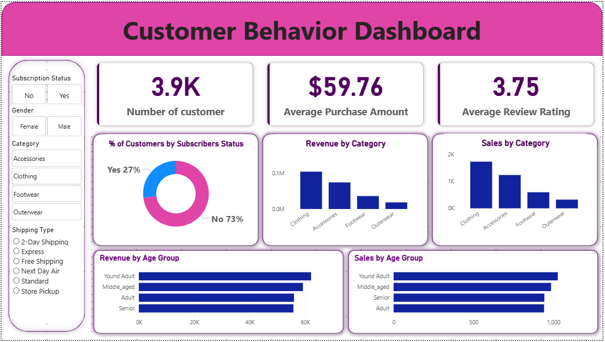

# Customer Shopping Behavior Analysis 🛒📊

## Project Overview
This project provides a comprehensive end-to-end analysis of customer shopping behavior using a dataset of 3,900 transactions. The goal is to identify key drivers of revenue, analyze customer segmentation, and provide data-driven recommendations for business growth.

---

## 📂 Project Structure & Navigation
Click the links below to navigate through the project phases:

* **[Data Cleaning (Python)](./Customer_shopping.ipynb):** Handling missing values (median imputation for ratings) and feature engineering using Pandas and NumPy.
* **[Database & Querying (SQL)](./Cutomer_datset.sql):** SQL scripts used for deep-dive analysis into gender revenue gaps and subscription trends.
* **[Interactive Dashboard (Power BI)](./Customer_behavior_dashboard.pbix):** The original Power BI file containing interactive filters for Age, Gender, and Category.
* **[Final Report (PDF)](./Customer%20Shopping%20Behavior%20Analysis.pdf):** A detailed document summarizing findings and business strategies.
* **[Presentation (PPTX)](./Customer-Shopping-Behavior-Analysis.pptx):** A slide deck designed for stakeholder presentations.

---

## 🚀 Key Insights & Findings
* **Revenue Leader:** Male customers generate **2.1x more revenue** than female customers.
* **Top Category:** **Clothing** is the highest revenue-generating category across all age groups.
* **Target Demographic:** **Young Adults (18-35)** contribute the highest total revenue ($62,143), followed closely by Middle-aged adults.
* **Subscription Opportunity:** While 73% of customers are not subscribed, "Loyal" repeat buyers offer a massive opportunity for conversion to subscription models.

---

## 📊 Dashboard Preview
Below is a snapshot of the interactive dashboard built to visualize these metrics:

---

## 🛠️ Tools & Technologies Used
* **Python:** Data cleaning and preprocessing.
* **SQL (PostgreSQL/SQL Server):** Advanced data querying.
* **Power BI:** Data visualization and DAX modeling.
* **
